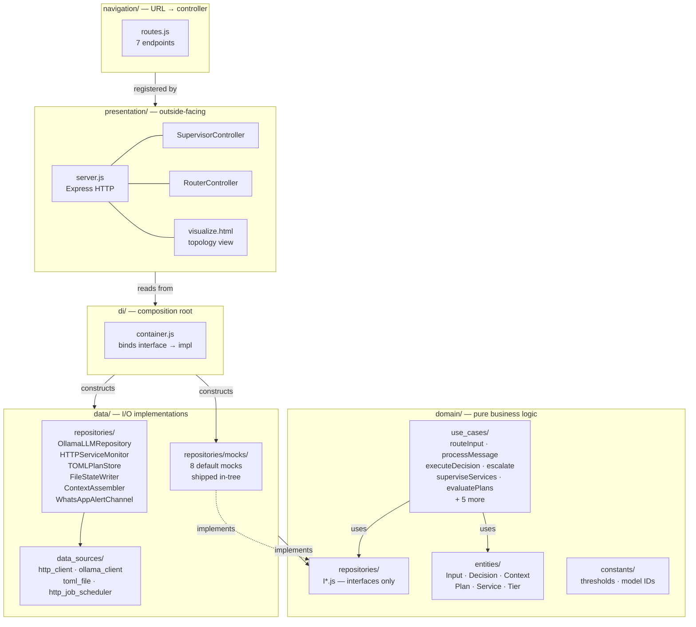
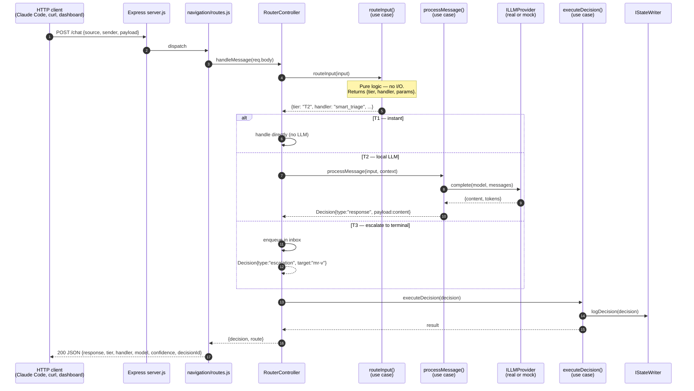
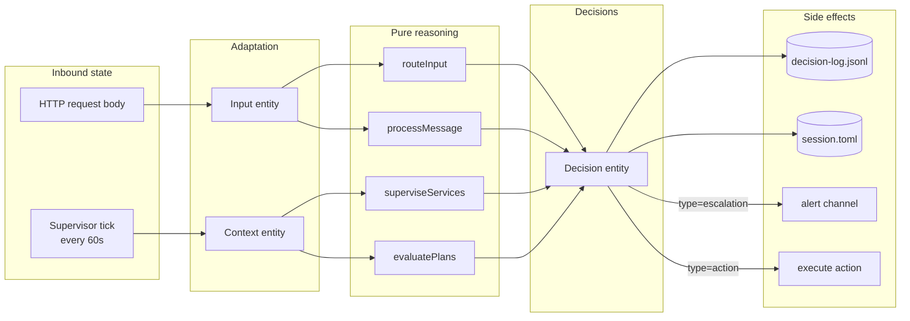
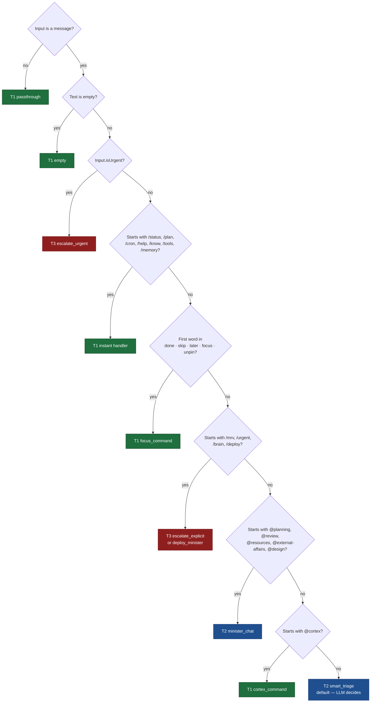
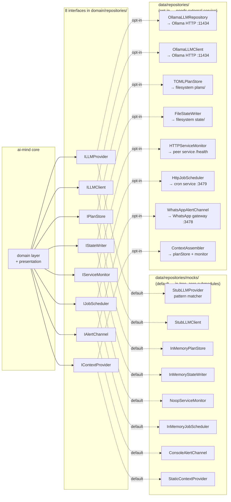

# ARCHITECTURE.md

How `ai-mind` is built. Five diagrams + the prose to read them by.

If you're new here, start with the `README.md` overview. This file is the deeper layer — what the architecture actually looks like, why it's shaped this way, and where the seams are.

---

## 1. Component diagram (clean architecture layers)

**Read this as:** five concentric layers with one composition root.

`domain/` is the inner core — pure JavaScript, no `require('fs')` or `require('http')`, no global state, no side effects. Every business rule lives here as a small function in `use_cases/` operating over data classes in `entities/`. When `domain/` needs to talk to the outside, it does so through interfaces in `domain/repositories/i_*.js` — pure abstract classes that throw `not implemented` on every method.

`data/` is the I/O layer. Concrete classes (`OllamaLLMRepository`, `HTTPServiceMonitor`, etc.) implement those interfaces with real network calls, filesystem reads, and timers. `data/repositories/mocks/` ships eight in-tree mocks that implement the same interfaces with zero I/O — `[mock]` LLM responses, in-memory plan stores, console alerts. See `CONTRACTS.md` for the per-binding spec.

`presentation/` is HTTP. Two controllers — `SupervisorController` (the watchdog loop) and `RouterController` (request handling) — wrap use cases for the outside world. `navigation/routes.js` maps URL patterns to controller methods. `visualize.html` is a static page that polls `/status` and renders a live topology graph.

`di/container.js` is the composition root — the only place that knows about concrete classes. It reads config (or env vars) and decides whether each binding gets a real implementation or a mock. Everything else works only with interfaces.

---

## 2. Request flow (POST /chat)

**Read this as:** every input passes through three stages.

**Routing** (step 4–5) is pure pattern matching. `routeInput()` reads the message text, applies a fixed set of rules (T1 commands, T3 prefixes, minister mentions), and returns `{tier, handler, params}` in microseconds. No LLM, no I/O. This is the only stage that runs on every request without exception.

**Processing** (step 6–11) is where work actually happens. T1 (tier 1) handlers respond instantly with no model — `/status` queries the supervisor, `/help` returns a static string. T2 calls the local LLM through `ILLMProvider`; the mock returns a `[mock]`-tagged echo, the real implementation hits Ollama. T3 enqueues the message in an inbox for an executive (a human or higher-tier agent) to handle.

**Execution** (step 12–13) is the audit + side-effect stage. Every decision is logged via `IStateWriter` before the response leaves. If the decision targets an external service (`target: "service:senses"`), `executeDecision` would also dispatch the side effect — but the result returns to the caller regardless.

The shape of the response is always the same: a `Decision` object plus the routing metadata that produced it. Logs are append-only. Replays are possible because every step is deterministic given its inputs.

---

## 3. Data flow (state through the layers)

**Read this as:** state is a pipeline, not a graph.

Inputs arrive in two shapes: HTTP requests (one-shot, sender-driven) and supervisor ticks (recurring, scheduler-driven). Both are normalized into domain entities — `Input` for messages, `Context` for periodic snapshots — before any reasoning happens. The adapter layer (`InputAdapter`, `ContextAssembler`) is the boundary that prevents HTTP-shaped concerns from leaking into business rules.

Reasoning is a flat layer of pure functions. None of them mutate global state, write files, or make network calls. They take entities in and return `Decision` entities out. This is what makes them trivially testable — every test in `domain/use_cases/*.test.js` constructs an Input/Context, calls a function, asserts on the returned Decision. Zero setup.

Side effects all happen downstream of the decision, in the execution stage. A decision is logged before any side effect fires — so even if the side effect crashes, the decision is recoverable. Append-only JSONL for the decision log, point-in-time TOML for session state. The alert channel and action executor are themselves interfaces (`IAlertChannel`, deferred to specific dispatchers) — replaceable, mockable, never throwing on failure.

---

## 4. Decision tree (how routeInput classifies)

**Read this as:** routing is explicit and complete.

The classifier is a fall-through — every branch above the default is a specific pattern; anything that doesn't match defaults to T2 smart triage (where the local LLM is asked to make sense of the input). The order matters: urgent flag wins over command parsing, which wins over focus commands, which wins over T3 escalations, which win over minister mentions. This deterministic precedence is the test surface — `domain/use_cases/route_input.test.js` exhaustively covers every branch.

The three tiers correspond to escalating compute cost. **T1** is microseconds — string matching plus a local lookup. No model, no network. **T2** is hundreds of milliseconds — local LLM on Ollama (or the `[mock]` stub). **T3** is human time — the message lands in an inbox; an executive (typically Mr. V in a Claude Code session, or a human on WhatsApp) handles it. Cost goes up by 1000× per tier; throughput goes down by 1000×. Routing minimizes both by sending each input to the cheapest tier that can handle it.

The **smart triage** default (bottom-right) is where the local LLM is invited to be smart. Anything that didn't match an explicit rule lands here, and `processMessage` asks the LLM to assess complexity and choose its own response strategy. This is the single highest-leverage path — getting smarter mocks here would compound; getting a smarter local model here would compound more.

---

## 5. External boundaries (what mind needs from outside)

**Read this as:** every external touchpoint has two implementations.

The audit (`AUDIT.toml`) found exactly eight points where ai-mind reaches for the outside: language models (two flavors), persisted state (plans + session), service monitoring + cron jobs, alerts, and context assembly. Each is fronted by an interface in `domain/repositories/`. Each interface has a default mock that works without any external service, and a real implementation that hits the named external dependency.

The DI container picks per-binding which implementation gets wired. The default — chosen at `createContainer()` time with no config — is **all mocks**. This is the zero-submodule install promise: clone the repo, `npm install`, `npm start`, and the supervisor + router both work end-to-end with no Ollama running, no peer services up, no WhatsApp gateway, no filesystem writes. Tier-1 commands return real responses (the supervisor really does query its own state); tier-2 chats return `[mock]`-tagged stubs; tier-3 escalations land in an in-memory inbox.

Opting into a real implementation is a per-binding flip: `createContainer({ use: { llm: 'real' }, ollamaHost: '...' })` swaps just the LLM, leaves everything else mocked. Or `MIND_USE_REAL=all node index.js` flips everything via env. The interfaces are the contract; the wiring is config. See `CONTRACTS.md` for the full per-binding swap recipes.

---

## How the layers actually depend on each other

The dependency arrow points only inward.

| Layer | Depends on | Does NOT depend on |
|---|---|---|
| `domain/` | nothing (other than Node built-ins) | data, presentation, di, navigation |
| `data/` | `domain/` interfaces, Node built-ins | presentation, di, navigation |
| `presentation/` | `domain/` use cases + entities, `navigation/` | data (talks via DI-injected handles) |
| `navigation/` | `presentation/` controllers | data, di |
| `di/` | everything (composition root) | — |

This is enforced by code review and visible in the `require()` graph — if a domain file ever requires anything from `data/` or `presentation/`, it's a bug. The audit (`AUDIT.toml`) confirmed: zero violations.

The benefit of the rule shows up in three places. Tests for `domain/` use cases construct entities directly and call functions — no mocking framework, no setup. Real implementations in `data/` swap freely without touching reasoning logic. New presentation surfaces (an MCP wrapper, a CLI binary) wrap controllers without rewriting the cognitive flow. All three trace to the same root: the inner core knows nothing about the outside.

---

## What this architecture deliberately doesn't do

- **No global mutable state.** Every use case is a function; controllers hold their own state explicitly; the container is constructed once at boot. There's nowhere for a stale singleton to hide.
- **No fault tolerance compounded into business logic.** If a real implementation fails, the call surfaces the error. The mock-vs-real choice is a deployment decision, not a runtime fallback.
- **No "smart" magic in the DI container.** It maps a string ("real" / "mock") to a class. No service location, no decorators, no auto-wire. If you can't read `di/container.js` and predict what `createContainer({use:{llm:'real'}})` returns, the container has grown wrong.
- **No tightly coupled tests.** Tests under `domain/use_cases/` know nothing about `data/`. A test failure tells you a business rule broke, not that the network blipped.

---

## See also

- `README.md` — the entry point; this file is its deeper reference
- `EXTRACTION_STRATEGY.md` — why mockability is a first-class shipping promise
- `CONTRACTS.md` — per-interface mock specs and swap recipes
- `AUDIT.toml` — the inventory that proves this architecture's external-coupling claims
- `tests/zero_submodule_smoke.test.js` — executable proof of the contract
