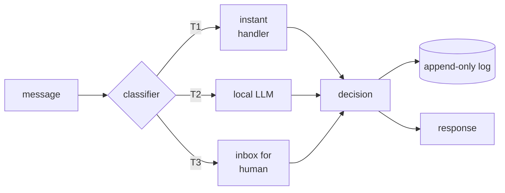

# ai-mind

> The cognitive layer for AI agents. Receives messages, classifies them by complexity (T1 instant / T2 local / T3 escalate), and produces auditable decisions. Works standalone with built-in mocks; opts into Ollama, peer services, and notification channels when you have them.

[](./tests) [](./CONTRACTS.md) [](./LICENSE)

---

## What is this?



You hand it a message. It picks the cheapest tier that can handle it — pattern-match for instant commands, local LLM for routine chat, an inbox for escalations a human should see. Every step produces a `Decision` object that's logged before the side effect fires. The whole thing runs in-process via HTTP, MCP, or CLI.

It's the brain of [raj-sadan](https://github.com/vraj0703/raj-sadan), but it works without raj-sadan. That's the whole point of this repo.

---

## Why does it exist?

Most AI agent frameworks bundle decision-making with execution, transport, and tool integration. That makes them hard to reason about and harder to test. `ai-mind` is the inverse: pure decision-making, with everything I/O-shaped abstracted behind interfaces. The default implementations are mocks; the real ones are opt-in.

That choice has three consequences:

1. **Zero-submodule install works.** `git clone && npm install && npm start` produces a running cognitive service. No Ollama. No peer services. No env vars. The mocks are good enough for tier-1 commands and tests.
2. **Tests are fast and deterministic.** 161 tests in 270ms. None of them touch the network. None of them need a model.
3. **The cognitive logic is portable.** Drop into any AI agent setup that speaks HTTP, MCP, or CLI. Wire your own services for the parts you care about; leave mocks for the rest.

If "small, sharp, mockable" appeals to you, this is for you. If you want a batteries-included agent platform, look elsewhere.

---

## Tech stack

| Layer | Choice | Why |
|---|---|---|
| Runtime | Node.js v22+ | Built-in `node --test`, no transpile, fast |
| HTTP | Express 5 | Minimal, well-known, room for the route table |
| LLM (real) | Ollama via HTTP | Local-first; swap to anything that implements `ILLMProvider` |
| LLM (mock) | Pattern matcher | `[mock]`-tagged responses, deterministic |
| Persistence (real) | TOML files | Human-readable, version-controlled |
| Persistence (mock) | In-memory | Tests; zero-submodule mode |
| Topology viz | Cytoscape + Dagre | Renders `/visualize` page |
| TOML parsing | smol-toml | Lightweight, no native deps |
| Tests | `node --test` | No Jest, no Mocha, no extra dep |
| Architecture | Clean (Uncle Bob) | Inner core knows nothing about outside |
| Type system | JSDoc comments | Type-checked by editors, no TS toolchain |

---

## Quickstart

### Install
```bash
git clone https://github.com/vraj0703/ai-mind.git
cd ai-mind
npm install
```

### Run (all mocks — works immediately)
```bash
npm start
# → ai-mind listening on http://127.0.0.1:3486
# → bindings: real=[none], mock=[8]
```

### Try it
```bash
curl -X POST http://127.0.0.1:3486/chat \
  -H 'Content-Type: application/json' \
  -d '{"source":"cli","sender":"you","payload":"/status"}'
```

### Test
```bash
npm test
# → 161 passing
```

### Run with real LLM
```bash
# Requires Ollama running on :11434
MIND_USE_REAL=llm,llmClient OLLAMA_HOST=http://localhost:11434 npm start
```

### Run inside Claude Code (MCP mode)
See `MCP-INTEGRATION.md` (after RAJ-42 lands).

---

## Architecture (the short version)

`ai-mind` follows clean architecture. Code is organized into five layers, with the dependency arrow pointing inward only.

```
mind/
├── domain/          ← pure business logic (use cases, entities, interfaces)
├── data/            ← I/O implementations (real + mocks)
├── presentation/    ← HTTP server, controllers, the visualize page
├── navigation/      ← URL → controller mapping
└── di/              ← composition root — binds interfaces to implementations
```

**The two things to know:**

1. **Interfaces live in `domain/repositories/i_*.js`.** The domain only ever sees abstract contracts — `ILLMProvider.complete()`, `IAlertChannel.send()`. Eight interfaces total. Implementations live in `data/`. Mocks live in `data/repositories/mocks/`. The DI container picks which gets wired.

2. **The router is fall-through, deterministic, and the only thing that runs on every request.** `routeInput()` reads the message text, runs through a fixed list of patterns (T1 commands → focus commands → T3 escalations → minister mentions → smart triage default), and returns a tier + handler. No LLM, no I/O, no surprises. Test coverage is exhaustive.

For the deeper pass — sequence diagrams, the decision tree as a flowchart, dependency rules, what the architecture deliberately doesn't do — see [`ARCHITECTURE.md`](./ARCHITECTURE.md). For the per-interface contract spec (default mocks vs. real implementations, swap recipes), see [`CONTRACTS.md`](./CONTRACTS.md). For the audit that drove the interface boundary, see [`AUDIT.toml`](./AUDIT.toml).

### Tiers

The classifier sorts every input into one of three tiers:

| Tier | Cost | Latency | Examples |
|---|---|---|---|
| **T1** | free | µs | `/status`, `/help`, `/plan`, `done`, `@cortex` |
| **T2** | local LLM tokens | ~hundreds of ms | `@planning <message>`, free-form chat |
| **T3** | human attention | minutes to hours | `/mrv`, `/urgent`, anything marked urgent |

Cost goes up by ~1000× per tier; throughput drops by ~1000×. Routing minimizes both by sending each input to the cheapest tier that can handle it.

---

## Theory & design decisions

A few choices in this codebase are non-obvious and worth understanding before you propose changes.

**Mockability is a shipping promise, not a developer convenience.** Every external dependency has an interface and a default mock. The mock works without external services. The real implementation is opt-in. This is enforced by the `tests/zero_submodule_smoke.test.js` suite — if it goes red, the contract is broken. The full rationale lives in [`EXTRACTION_STRATEGY.md`](./EXTRACTION_STRATEGY.md).

**Decisions are first-class objects, not side effects.** Every action `ai-mind` takes — a response, an action, an escalation, an observation — is constructed as a `Decision` entity first. The decision is validated, logged, and only then dispatched. This makes the entire reasoning chain auditable and replayable. It's also what makes the `IStateWriter` interface meaningful: replace it with anything that can persist a JSON-serialisable object and you have a full audit trail.

**The router is a fall-through pattern matcher, not an LLM.** A common pattern in agent frameworks is to send everything to a model and let it route. `ai-mind` doesn't do that. The classifier in `routeInput()` is deterministic — every branch is testable, every behaviour is predictable, and most inputs (T1 / T3) never touch a model. Only the smart-triage default falls through to the LLM. This is the highest-leverage decision in the codebase: it makes the system fast, cheap, and explainable.

**No fault tolerance compounded into business logic.** If you ask for a real LLM and Ollama is down, the call fails loudly. There's no automatic mock-fallback. The mock-vs-real choice is made at boot, not at runtime. The reasoning: silent fallbacks compound failure modes invisibly. A test that passes because it silently downgraded to mocks is worse than a test that fails honestly.

**JSDoc instead of TypeScript.** The codebase is plain JavaScript with rich JSDoc comments. Editors get type-checking; CI doesn't need a transpile step; the npm install is small. This is a deliberate tradeoff against TypeScript's stronger guarantees in exchange for zero build complexity. If the codebase grows past ~10K LOC this might flip; for now, it works.

---

## Project structure

```
mind/
├── README.md                       ← you are here
├── ARCHITECTURE.md                 ← deeper dive: 5 mermaid diagrams + dependency rules
├── EXTRACTION_STRATEGY.md          ← why submodule + mockability framework
├── CONTRACTS.md                    ← per-interface mock specs and swap recipes
├── AUDIT.toml                      ← every external coupling, classified
├── LICENSE                         ← MIT
├── package.json                    ← deps + scripts
├── index.js                        ← entry point
│
├── domain/                         ← pure business logic
│   ├── use_cases/                  ←   11 use cases (routeInput, processMessage, ...)
│   ├── entities/                   ←   9 data classes (Input, Decision, Context, Plan, ...)
│   ├── repositories/               ←   8 interface definitions (i_*.js)
│   └── constants/                  ←   thresholds, model IDs, timeouts
│
├── data/                           ← I/O implementations
│   ├── repositories/               ←   real implementations of the 8 interfaces
│   │   └── mocks/                  ←   default in-tree mocks (8 of them)
│   └── data_sources/               ←   lower-level clients (HTTP, file, Ollama)
│       ├── local/                  ←   filesystem-backed
│       └── remote/                 ←   HTTP-backed
│
├── presentation/
│   ├── pages/                      ←   server.js + visualize.html
│   └── state_management/           ←   SupervisorController + RouterController
│
├── navigation/
│   └── routes.js                   ← 7 endpoints
│
├── di/
│   └── container.js                ← composition root (only place that knows concrete classes)
│
└── tests/
    └── zero_submodule_smoke.test.js  ← executable proof of the mockability contract
```

---

## Operating modes

Two orthogonal axes — install mode and runtime mode.

**Install modes** (where the process runs):
- **HTTP server** — `npm start`, listens on :3486. The original raj-sadan integration.
- **MCP server** — `npx ai-mind mcp` (after RAJ-42 lands). Drop into Claude Code / Cursor / Codex via `.mcp.json`.
- **CLI** — `npx ai-mind <command>` for one-shot invocations from a shell.

**Runtime modes** (what gets wired):
- **Supervisor-of-self** (default) — empty `services` array, all mocks. The supervisor loop has nothing external to monitor. Good for standalone agent use, embedded use, tests.
- **With peers** — set `MIND_PEER_SERVICES=raj-sadan-organs` (or pass an explicit array) and the supervisor monitors those services' `/health` endpoints, restarts on failure, escalates on cascade.
- **Custom topology** — pass any list of `{name, port, healthUrl}` objects to monitor. Useful for embedding `ai-mind` into an arbitrary service mesh.

The two axes combine. MCP mode + supervisor-of-self is "drop into Claude Code, do cognitive work, monitor nothing." HTTP mode + with-peers is the raj-sadan boot path. CLI mode + supervisor-of-self is "run a one-shot decision against a real LLM." All combinations work; pick by use case.

---

## Contributing

The repo's invariants:

- **Domain doesn't `require()` anything from `data/`, `presentation/`, or `di/`.** If it does, it's a bug. The audit (`AUDIT.toml`) confirms this; keep it true.
- **Every new external dependency gets an interface, a mock, and a real implementation in that order.** Read `CONTRACTS.md` before adding bindings.
- **Tests stay fast.** No tests should touch the network or wait on a real model. If a feature can't be tested cheaply, the feature design is probably wrong.
- **Mockability contract stays green.** `tests/zero_submodule_smoke.test.js` must pass on every PR. Treat it as a load-bearing test.
- **No partial-real bindings.** A binding is fully real or fully mock — no "real with mock fallback" hybrids. This is in `EXTRACTION_STRATEGY.md` for a reason.

Open an issue or PR. The codebase is small enough to read in an afternoon.

---

## License

MIT. See [`LICENSE`](./LICENSE).

---

## See also

- [`ARCHITECTURE.md`](./ARCHITECTURE.md) — the deep architectural reference (5 diagrams + prose)
- [`EXTRACTION_STRATEGY.md`](./EXTRACTION_STRATEGY.md) — why the codebase is shaped this way
- [`CONTRACTS.md`](./CONTRACTS.md) — per-interface mock specs and swap recipes
- [`AUDIT.toml`](./AUDIT.toml) — the inventory that proves the external-coupling claims
- `ONBOARDING.md` (RAJ-22, in flight) — install + integration guide
- `MCP-INTEGRATION.md` (RAJ-42, in flight) — MCP server packaging
